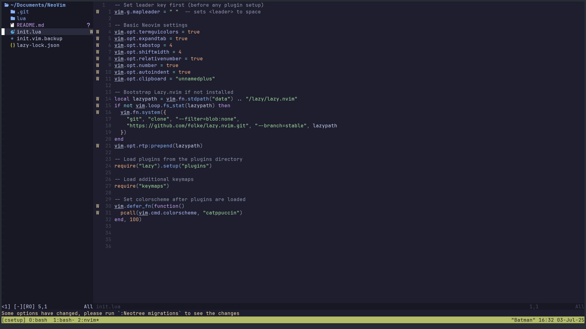
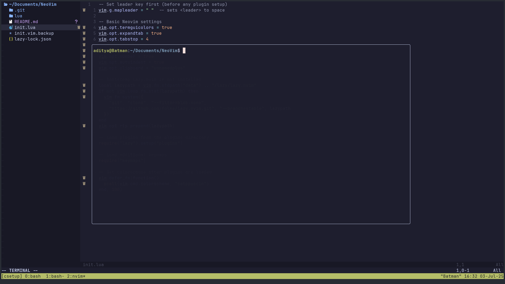

# My Neovim Setup



## Prerequisites

```bash
# Install Neovim and dependencies
sudo apt update
sudo apt install neovim git nodejs npm python3 python3-pip

# Install a Nerd Font
wget -P ~/.local/share/fonts https://github.com/ryanoasis/nerd-fonts/releases/download/v3.0.2/JetBrainsMono.zip
cd ~/.local/share/fonts && unzip JetBrainsMono.zip && fc-cache -fv
```

## Installation

```bash
# Backup existing config
mv ~/.config/nvim ~/.config/nvim.backup.$(date +%Y%m%d_%H%M%S)

# Clone this config
git clone <YOUR_REPO_URL> ~/.config/nvim

# Start Neovim (plugins will auto-install)
nvim
```

## Key Mappings

- **Leader key**: `<Space>`
- `<leader>ff` - Find files
- `<leader>e` - Toggle file explorer
- `<leader>gs` - Git status
- `gd` - Go to definition
- `K` - Show documentation

## File Structure

```
~/.config/nvim/
├── init.lua
├── lua/
│   ├── config/
│   ├── plugins/
│   └── utils/
└── README.md
```

That's it! Open Neovim and start coding.
